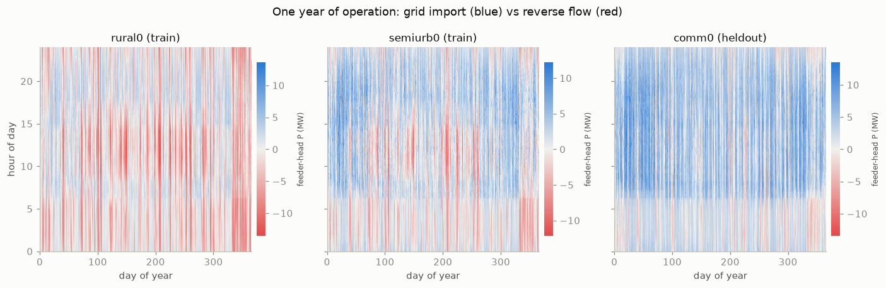
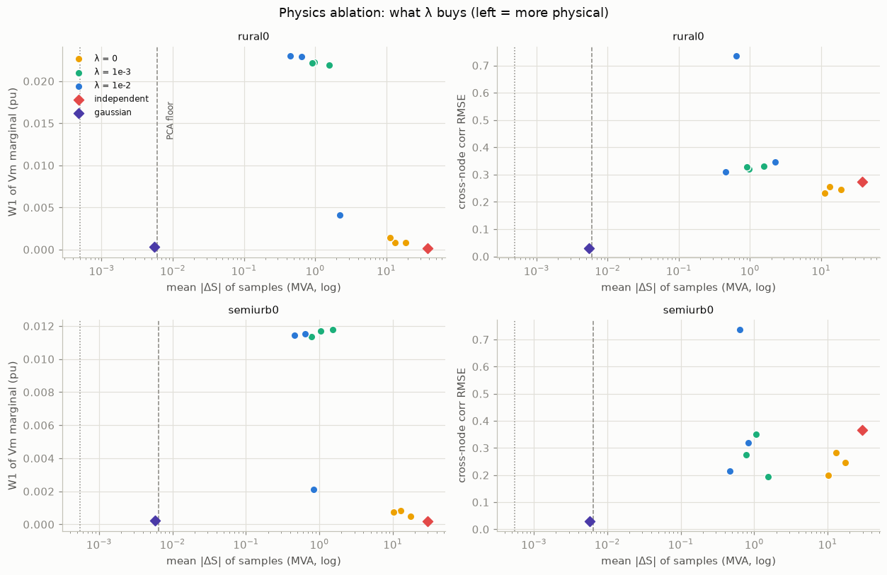
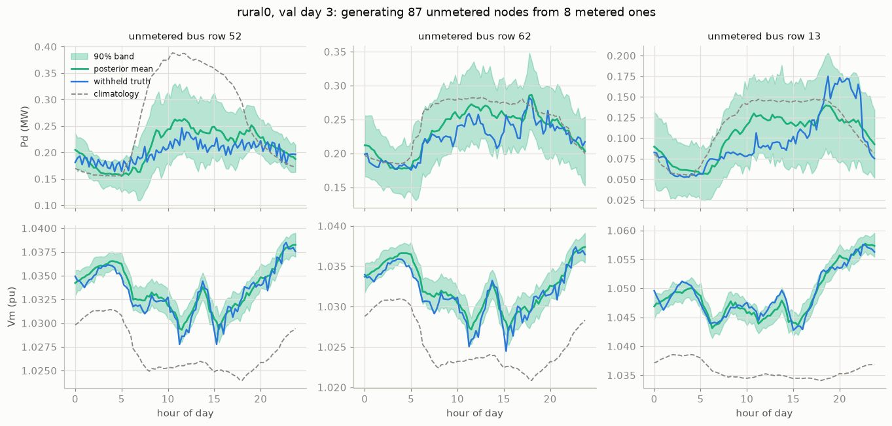

# physics-consistent-feeder-generation

**How do you build a generative model of distribution-feeder operating data that
cannot violate power flow?** This repository answers that question empirically, at
laptop scale, with every claim backed by an executed notebook and multi-seed
statistics — including three deliberate negative results.

Given a medium-voltage feeder (topology, line parameters, per-bus nameplate data),
the models here sample **whole days of operation** — 96 × 15-min steps of P, Q, V, θ
at every bus — and are graded on three axes at once:

- **statistical fidelity** — the validation methodology of Cramer et al. (IEEE
  Access, 2022) extended with network quantities (feeder-head aggregate, cross-bus
  correlation, reverse-flow share);
- **physical feasibility** — the full-Ybus nodal power-balance residual in MVA, the
  one metric a generator cannot game;
- **diversity** — across-sample variability, added after milestone 3 caught a
  failure mode that pooled statistics cannot see.

*The data being modeled: one year × one day of feeder-head power on the three feeders.
Red = reverse flow (DER exceeds load) — wind-driven day-long stripes and pre-dawn bands,
15–56% of the year. Every generated day is graded against the statistics and physics of
this dataset (105,408 solved AC power flows, residual ≤ 8e-8 MVA).*

## The eight findings

| # | Claim | Evidence |
|---|---|---|
| 1 | A full-year, physics-gated feeder dataset is buildable in minutes | 105,408 AC power flows on 3 SimBench MV feeders, 0 failures, residual ≤ 8e-8 MVA; wind-driven reverse flow 15–56% of the year (notebook 01) |
| 2 | Statistical metrics alone are gameable — the physics residual is not | a node-independent bootstrap wins the statistical scorecard while violating power balance by 38 MVA mean (02) |
| 3 | An unconstrained deep generator is severely unphysical | graph-conditioned normalizing flow: plausible statistics at 17 MVA mean mismatch, voltages to 1.10 pu the feeder never produces (02) |
| 4 | A sample-based physics penalty helps — by a pathological mechanism | 12–17× residual reduction across 3 seeds, but via **diversity collapse**: voltage variability falls to 3% of real; one seed emits a single repeated day (03) |
| 5 | At MV scale the AC manifold is locally near-affine → **physics by representation** | generating inside the span of solved days reaches the representation floor (0.006 MVA, 2000× better than the free flow), healthy diversity, 10× better cross-bus correlation (03/04) |
| 6 | One feeder-year of day-scores is statistically Gaussian | trained flows tie the Gaussian in validation likelihood and trail it on physical metrics; deep generative capacity needs the many-feeder regime (04) |
| 7 | Conditioning = pseudo-measurement generation, exact and calibrated | 8 metered buses → 87 unmetered with closed-form posteriors: MAE 26–91% below climatology, 90%-band coverage 85–92% after modeling representation error (04) |
| 8 | Transfer needs weeks, not years — and seasons do not transfer implicitly | floor physics from 7 days of target data (vs 84.8 MVA zero-shot); statistics mature at 30–60 days; cross-feeder weights do **not** carry seasonal structure — exogenous weather/calendar covariates are required (05) |

*The central experiment (findings 3–5). Each point is a trained generator: the physics
penalty (λ) moves the flow an order of magnitude left at visible fidelity cost — while
the day-subspace Gaussian (violet diamond) sits at the representation floor with no
penalty at all. Physics belongs in the representation, not the loss.*

*Finding 7 in action: 8 metered buses (of 95) pin the whole feeder. Blue = withheld
truth, green = posterior mean and 90% band, dashed = climatology. The intra-day voltage
dips are recovered at buses that were never metered — network coupling doing
informational work, with bands that are tested (85–92% empirical coverage), not drawn.*

## Reading order

The narrative lives in five executed notebooks (figures baked in), each one
milestone of the build; [`LEDGER.md`](LEDGER.md) is the authoritative log of every
result, assumption, and deviation.

1. [`01_temporal_dataset`](notebooks/01_temporal_dataset.ipynb) — the "real" data: full-year AC-PF states, physics-gated
2. [`02_generator_v0`](notebooks/02_generator_v0.ipynb) — a graph-conditioned normalizing flow, honestly graded
3. [`03_physics_ablation`](notebooks/03_physics_ablation.ipynb) — the physics-penalty ablation and the collapse discovery
4. [`04_subspace_and_conditionals`](notebooks/04_subspace_and_conditionals.ipynb) — physics by representation + calibrated pseudo-measurements
5. [`05_generalization`](notebooks/05_generalization.ipynb) — feeder transfer and the seasonal negative result

## Lineage

The method builds on a completed recreation of the ETH Zürich MSc thesis
*"Foundation Model for the Power Grid"* (Mazzonelli, 2025):
[`gridfm-thesis-recreation`](https://github.com/panas-bhattarai/gridfm-thesis-recreation)
— masked-reconstruction pre-training with a power-balance loss, where the
topology-aware architecture (GPSConv + admittance-weighted RWPE) proved to govern
topology transfer. The companion study
[`feeder-reconfiguration-invariance`](https://github.com/panas-bhattarai/feeder-reconfiguration-invariance)
extends that result to reconfigurable distribution feeders (fine-tuned topology-aware
models solve power flow at 2–8% voltage error on unseen feeders, flat across switching
states). This repository takes the third step: from *reconstructing* grid states to
*generating* them.

## Reproducing

Python 3.11, versions pinned in [`requirements.txt`](requirements.txt); a 4 GB
laptop GPU covers every experiment (the full grid of 20+ training runs took a few
hours total). SimBench data is **not redistributed** — it is downloaded and the
dataset regenerated deterministically by `python -m gridfm.temporal_data <feeder>`
(seeded; the profiles are the scenario sequence, so regeneration is exact).
Training entry points: `gridfm/train_flow.py` (graph flow ± physics penalty),
`gridfm/train_day.py` (day-subspace flow), `gridfm/train_seasonal.py` (seasonal
experiment); evaluation: `gridfm/eval_m3.py` and the notebooks.

## License

MIT (code). SimBench data remains under its own license and is fetched at runtime
by the `simbench` package.

## AI-assisted development

This recreation was carried out with substantial assistance from an AI coding assistant,
under the direction and review of the author.
